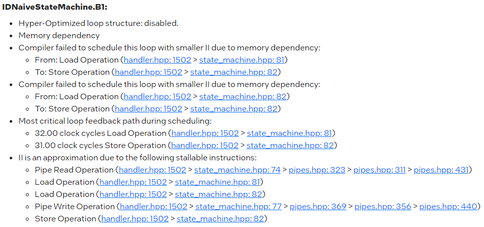
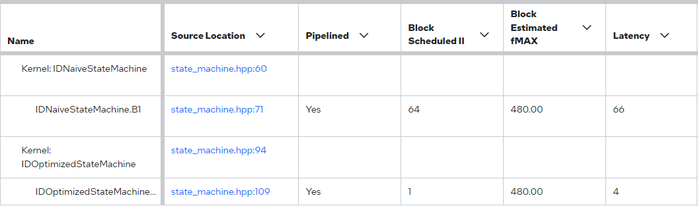

# `state_machine` Sample

This tutorial demonstrates how to make an efficient state machine design with the Intel® oneAPI DPC++/C++ FPGA compiler.

| Optimized for                     | Description
|:---                               |:---
| OS                                | Linux* Ubuntu* 18.04/20.04 <br> RHEL*/CentOS* 8 <br> SUSE* 15 <br> Windows* 10
| Hardware                          | Intel® Agilex® 7, Arria® 10, and Stratix® 10 FPGAs
| Software                          | Intel® oneAPI DPC++/C++ Compiler
| What you will learn               | Best practices for creating and managing a oneAPI FPGA project
| Time to complete                  | 10 minutes

> **Note**: Even though the Intel DPC++/C++ OneAPI compiler is enough to compile for emulation, generating reports and generating RTL, there are extra software requirements for the simulation flow and FPGA compiles.
>
> To use the simulator flow, Intel® Quartus® Prime Pro Edition and one of the following simulators must be installed and accessible through your PATH:
> - Questa*-Intel® FPGA Edition
> - Questa*-Intel® FPGA Starter Edition
> - ModelSim® SE
>
> When using the hardware compile flow, Intel® Quartus® Prime Pro Edition must be installed and accessible through your PATH.
>
> :warning: Make sure you add the device files associated with the FPGA that you are targeting to your Intel® Quartus® Prime installation.

> **Note**: In oneAPI full systems, kernels that use SYCL Unified Shared Memory (USM) host allocations or USM shared allocations (and therefore the code in this tutorial) are only supported by Board Support Packages (BSPs) with USM support. Kernels that use these types of allocations can always be used to generate standalone IPs.

## Key Implementation Details

This code sample demonstrates two different implementations of a state machine using SYCL High-Level Synthesis (HLS) on Intel FPGAs: the naive version and the optimized version. We will compare and analyze the Quality of Result (QoR) differences between them.

### Naive Implementation
The naive implementation (`class NaiveStateMachine`) uses basic state machine logic with direct data read and write operations within a loop. Depending on the state, it either processes data in the `State::PROCESS` by multiplying it with a coefficient `coeff` or loads a new coefficient in `State::LD_COEFF` state. State transitions are manually handled within the loop using a swich-case statement, and computation/operations are coded in the body of the each case, then performed sequentially.

### Optimized Implementation
The optimized implementation (`class OptimizedStateMachine`) employs the `task_sequence` feature from the SYCL HLS compiler, which allows for more fine-grained control of parallelism and dependency management. Similar to the naive implementation, the state transition and states are defined in a switch-case statement with each case representing a state of the state machine. However, instead of defining the operation inside the case body, this approach defines tasks (`updateCoeff` and `compute`) that are executed asynchronously, enabling the isolation of long initiation intervals (II) and improving throughput by reducing dependency chains between states.

### Limitations of the Naive Version

The naive implementation suffers from several key limitations:
- **Inefficient State Management:** State transitions and data processing are tightly coupled, leading to increased latency and reduced efficiency in state management.
- **Dependency Bottlenecks:** Each state depends linearly on the completion of the previous state, creating bottlenecks and increasing the total execution time.



### Improvements brought by `task_sequence`

Utilizing `task_sequence` in the optimized implementation offers significant enhancements:
- **Enhanced Parallelism:** By decoupling computational dependencies, `task_sequence` allows for more parallel operations, improving overall execution speed and throughput.
- **Reduced Initiation Interval:** The feature isolates unnecessary dependencies between states, which minimizes the initiation interval and maximizes the FPGA's computational efficiency. This enables the compiler to hide the high II from loading the coefficients in the `State::LD_COEFF` state and hence achieves a better overall II for this design.



## Build the `hardware_reuse` Tutorial
> **Note**: When working with the command-line interface (CLI), you should configure the oneAPI toolkits using environment variables.
> Set up your CLI environment by sourcing the `setvars` script located in the root of your oneAPI installation every time you open a new terminal window.
> This practice ensures that your compiler, libraries, and tools are ready for development.
>
> Linux*:
> - For system wide installations: `. /opt/intel/oneapi/setvars.sh`
> - For private installations: ` . ~/intel/oneapi/setvars.sh`
> - For non-POSIX shells, like csh, use the following command: `bash -c 'source <install-dir>/setvars.sh ; exec csh'`
>
> Windows*:
> - `C:\"Program Files (x86)"\Intel\oneAPI\setvars.bat`
> - Windows PowerShell*, use the following command: `cmd.exe "/K" '"C:\Program Files (x86)\Intel\oneAPI\setvars.bat" && powershell'`
>
> For more information on configuring environment variables, see [Use the setvars Script with Linux* or macOS*](https://www.intel.com/content/www/us/en/develop/documentation/oneapi-programming-guide/top/oneapi-development-environment-setup/use-the-setvars-script-with-linux-or-macos.html) or [Use the setvars Script with Windows*](https://www.intel.com/content/www/us/en/develop/documentation/oneapi-programming-guide/top/oneapi-development-environment-setup/use-the-setvars-script-with-windows.html).

Use these commands to run the design, depending on your OS.

### On a Linux* System
This design uses CMake to generate a build script for GNU/make.

1. Change to the sample directory.

2. Configure the build system for the Agilex® 7 device family, which is the default.

   ```
   mkdir build
   cd build
   cmake ..
   ```

   You can create a debuggable binary by setting `CMAKE_BUILD_TYPE` to `Debug`:

   ```
   mkdir build
   cd build
   cmake .. -DCMAKE_BUILD_TYPE=Debug
   ```

   If you want to use the `report`, `fpga_sim`, or `fpga` flows, you should switch the `CMAKE_BUILD_TYPE` back to `Release`:

   ```
   cmake .. -DCMAKE_BUILD_TYPE=Release
   ```

   > **Note**: You can change the default target by using the command:
   >  ```
   >  cmake .. -DFPGA_DEVICE=<FPGA device family or FPGA part number>
   >  ```
   >
   > Alternatively, you can target an explicit FPGA board variant and BSP by using the following command:
   >  ```
   >  cmake .. -DFPGA_DEVICE=<board-support-package>:<board-variant>
   >  ```
   >
   > You will only be able to run an executable on the FPGA if you specified a BSP.

3. Compile the design. (The provided targets match the recommended development flow.)

   1. Compile for emulation (fast compile time, targets emulates an FPGA device).
      ```
      make fpga_emu
      ```
   2. Generate the HTML optimization reports.
      ```
      make report
      ```
   3. Compile for simulation (fast compile time, targets simulator FPGA device).
      ```
      make fpga_sim
      ```
   4. Compile with Quartus place and route (To get accurate area estimate, longer compile time).
      ```
      make fpga
      ```

### On a Windows* System

1. Change to the sample directory.
2. Configure the build system for the Intel® Agilex® 7 device family, which is the default.
   ```
   mkdir build
   cd build
   cmake -G "NMake Makefiles" ..
   ```
   > **Note**: You can override the default target by using the command:
   >  ```
   >  cmake -G "NMake Makefiles" .. -DFPGA_DEVICE=<FPGA device family or FPGA part number>
   >  ```

3. Compile the design. (The provided targets match the recommended development flow.)

   1. Compile for emulation (fast compile time, targets emulated FPGA device).
      ```
      nmake fpga_emu
      ```
   2. Generate the optimization report. 
      ```
      nmake report
      ```
   3. Compile for simulation (fast compile time, targets simulator FPGA device).
      ```
      nmake fpga_sim
      ```
   4. Compile with Quartus place and route (To get accurate area estimate, longer compile time).
      ```
      nmake fpga
      ```

> **Note**: If you encounter any issues with long paths when compiling under Windows*, you may have to create your ‘build’ directory in a shorter path, for example `C:\samples\build`.  You can then run cmake from that directory, and provide cmake with the full path to your sample directory.


## Run the `state_machine` Executable

### On Linux
1. Run the sample on the FPGA emulator (the kernel executes on the CPU).
   ```
   ./state_machine.fpga_emu
   ```
2. Run the sample on the FPGA simulator device.
   ```
   export CL_CONTEXT_MPSIM_DEVICE_INTELFPGA=1
   ./state_machine.fpga_sim
   ```
3. Alternatively, run the sample on the FPGA device (only if you ran `cmake` with `-DFPGA_DEVICE=<board-support-package>:<board-variant>`).
   ```
   ./state_machine.fpga
   ```
### On Windows
1. Run the sample on the FPGA emulator (the kernel executes on the CPU).
   ```
   state_machine.fpga_emu.exe
   ```
2. Run the sample on the FPGA simulator device.
   ```
   set CL_CONTEXT_MPSIM_DEVICE_INTELFPGA=1
   state_machine.fpga_sim.exe
   set CL_CONTEXT_MPSIM_DEVICE_INTELFPGA=
   ```
3. Alternatively, run the sample on the FPGA device (only if you ran `cmake` with `-DFPGA_DEVICE=<board-support-package>:<board-variant>`).
   ```
   state_machine.fpga.exe
   ```

## Example Output

```
Running on device: SimulatorDevice : Multi-process Simulator (aclmsim0)
Test for optimized implementation of the state machine:
initialize coeff = 0.95... 
Process a vector of size 5
capture and check output...
PASSED

Test for naive implementation of the state machine:
initialize coeff = 1.95... 
Process a vector of size 5
capture and check output...
PASSED
```
## License
Code samples are licensed under the MIT license. See
[License.txt](https://github.com/oneapi-src/oneAPI-samples/blob/master/License.txt) for details.

Third party program Licenses can be found here: [third-party-programs.txt](https://github.com/oneapi-src/oneAPI-samples/blob/master/third-party-programs.txt).
